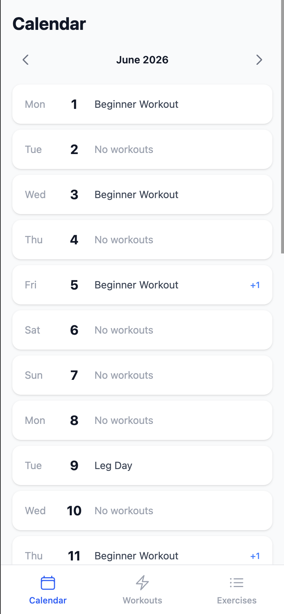
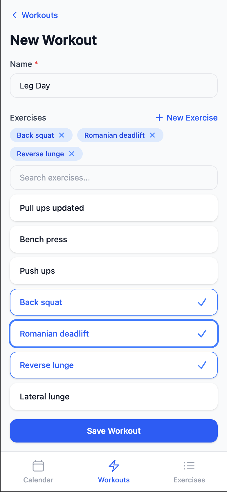

# Workout

A workout tracking application with a Symfony API backend and an Angular frontend.

## Features

- **Calendar** — view and navigate workout activity by date
- **Workouts** — create, browse, search, and view workout plans made up of exercises
- **Exercises** — create, browse, and search a library of exercises
- **Workout sessions** — log a completed workout (with start/end times) against a planned workout
- **Exercise sessions** — log sets/reps/weight for individual exercises within a workout session

 